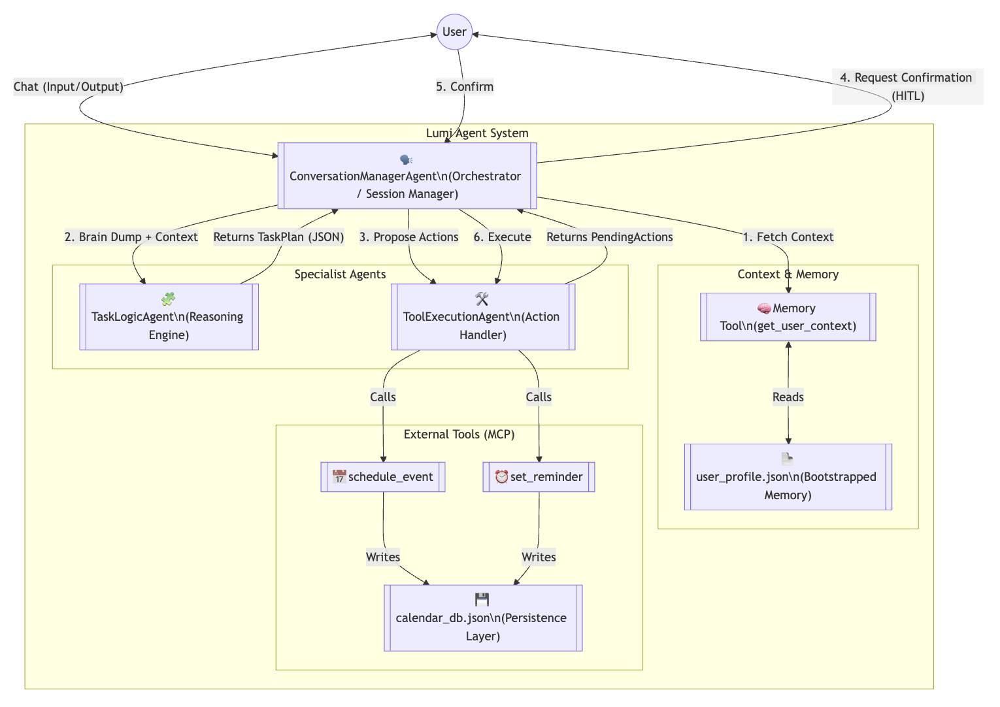

# 🕯️ Lumi – Your Calm in the Chaos
### An ADHD Executive Function Assistant powered by Google Gemini



---

## 📺 Demo Video
[](https://www.youtube.com/watch?v=YOUR_VIDEO_ID)
*(Replace with your actual YouTube link. If you don't have a thumbnail, just put the link: [Watch the Demo Video](LINK))*

---

## 🛠️ How to Run Locally

This agent uses **Google Gemini 2.5 Flash** via Google AI Studio. It is designed to run in VS Code or Jupyter Lab locally and stores state in JSON files.

### Prerequisites
* Python 3.10+
* A Google AI Studio API Key
* VS Code (Recommended) with the Jupyter and Python extensions installed.

### Installation
1.  **Clone the repository:**
    ```bash
    git clone [https://github.com/viveksahukar/adhd-assistant-capstone.git](https://github.com/viveksahukar/adhd-assistant-capstone.git)
    cd adhd-assistant-capstone
    ```

2.  **Create a Virtual Environment & Install dependencies:**
    ```bash
    python -m venv venv
    source venv/bin/activate  # On Windows use: venv\Scripts\activate
    pip install -q -r requirements.txt
    ```

3.  **Setup Credentials:**
    * Create a file named `.env` in the root folder.
    * Add your API key:
        ```text
        GOOGLE_API_KEY=your_actual_api_key_here
        ```

### Usage
1.  **Run the Agent:**
    * Open `adhd-assistant.ipynb` in VS Code.
    * Click **Select Kernel** in the top right and choose your `venv` (Python 3.10+).
    * Click **Run All**.
    * *This will initialize the agents, simulate a user "brain dump", and show the task decomposition and calendar scheduling in real-time.*

2.  **Run the Evaluation (Judge):**
    * To run the automated quality assessment, use the command line:
    ```bash
    python evaluation.py
    ```
    * This runs the LLM-as-a-Judge pipeline to grade the agent's performance agains a golden dataset.*

---

# 1. The Pitch: Solving Executive Dysfunction

## The Problem

Neurodivergent individuals, particularly those with ADHD, often struggle with executive dysfunction—specifically, **Task Paralysis** and **Time Blindness**. A simple instruction like "Plan the presentation" can feel insurmountable because the brain struggles to decompose the abstract goal into concrete steps. Traditional calendars are too static, and generic chatbots lack the stateful persistence required to be a true assistant.

## The Solution

I developed Lumi, an Agentic AI system designed to act as a "prosthetic prefrontal cortex." Unlike a standard LLM that simply answers questions, Lumi proactively:

1. **Decomposes** complex "brain dumps" into atomic, manageable actions.  
2. **Negotiates** priorities based on the user’s specific constraints (e.g., "I am an early bird").  
3. **Executes** scheduling actions directly into a persistent calendar system.

## Value Proposition

By automating the cognitive load of planning and scheduling, Lumi transforms anxiety-inducing projects into actionable, scheduled blocks, bridging the gap between intent and action for neurodivergent users.

---

# 2. The Build: Technical Implementation & Architecture

To move beyond a Level 1 "Connected Problem Solver," I architected a **Level 3: Collaborative Multi-Agent System**.

## Architecture: The Coordinator (Supervisor) Design Pattern

Lumi employs the **Coordinator Multi-Agent Architecture,** designed to decouple user interaction from the complex logic of task management.

Lumi is composed of three specialized agents working in a strict hierarchy:

* **ConversationManagerAgent (The Orchestrator):** This agent manages the **Session** state. It serves as the single point of contact for the user, maintaining the conversational thread and enforcing a **Human-in-the-Loop (HITL)** confirmation step before any world-altering actions are taken.  
* **TaskLogicAgent (The Reasoning Core):** A specialized agent focused purely on **Planning**. It utilizes **Chain-of-Thought** reasoning to analyze unstructured text and decompose it into an atomic TaskPlan.  
* **ToolExecutionAgent (The Hands):** A dedicated agent for **Action Execution**. It interfaces with external systems (mocked Calendar/Reminders) via defined tool schemas, ensuring the "reasoning" layer is separated from the "acting" layer.

## Strategic Rationale

I chose the **Coordinator Pattern** over a single monolithic agent to ensure **modularity** and **reliability**. By separating the "Brain" (Logic) from the "Hands" (Tools), the system prevents the reasoning model from accidentally executing actions during the planning phase, ensuring a safer and more predictable user experience.

## Model

I used **Gemini-2.5-Flash** because the older models were deprecated, and this one proved capable enough to handle the complex decomposition task while being faster and more efficient. I used the same model for both the **Agent** (Subject) and the **Judge** (Evaluator) to ensure the evaluation pipeline was robust and didn't fail on versioning errors.

## Tools (MCP-Style Integration)

I defined granular, action-oriented tools following best practices for tool descriptions.

* **schedule\_event**: Handles time-bound commitments.  
* **set\_reminder**: Handles floating tasks.  
* **get\_user\_context**: Retrieves persistent user data to ground the model.

## Context Engineering & Memory

I implemented a robust **Context Engineering** strategy to solve the "Cold Start Problem":

* **Bootstrapped Memory:** I implemented a **Bootstrapped Data** pattern using a user\_profile.json file. This simulates a high-trust knowledge base that instantly personalizes the agent (e.g., knowing the user prefers sub-tasks under 45 minutes).  
* **Long-Term Persistence:** I moved from ephemeral session state to file-based persistence (calendar\_db.json). This acts as the system's **Long-Term Memory**, allowing the agent to retain state across restarts, simulating a production database.

## Agent Evaluation (LLM-as-a-Judge)

To ensure reliability, I built a standalone **Evaluation Pipeline** (evaluation.py). This script functions as a "Green Agent" (Benchmark Agent) that uses a separate LLM instance to grade the assistant's outputs against a rubric for **Atomicity** and **Temporal Awareness**.

---

# 3. Challenges & Resolutions

During the build, I encountered three specific challenges that required applying advanced agentic concepts to resolve.

## The "Lazy Model" (Summarization Bias)

**Problem**: The TaskLogicAgent initially failed to decompose complex requests (e.g., "Prep presentation and buy eggs"). Instead of splitting them, it lazily grouped them into one giant task description, failing the Effectiveness pillar of Agent Quality10.

**Resolution**: I applied two advanced prompting techniques:

* **Chain-of-Thought:** I modified the system instruction to force the model to output a "reasoning" field *before* generating the task list. By forcing the model to "think" about the verbs first, I broke its tendency to summarize.  
* **Strict JSON Schema:** I enforced a structured output schema that explicitly defined the tasks as an ARRAY of objects. This structural constraint signaled to the model that multiple outputs were expected.

## Authentication Friction

**Problem**: The initial "Hybrid" workflow (Local VS Code \+ Remote Colab) caused significant friction. Interactive authentication (popups) required by Vertex AI failed in the headless Colab environment.

**Resolution**: I migrated to a Cloud-Native Workflow using Google AI Studio. I replaced complex Service Account authentication with a streamlined API Key approach managed via Colab Secrets. This aligned with the principle of optimizing for Velocity during the prototyping phase.

## Context Availability

**Problem**: After refactoring the code to use external files, the agent stopped decomposing tasks.

**Resolution**: I diagnosed this as a Context Alignment failure. The new user\_profile.json was missing specific instructions ("prefer sub-tasks \< 45 mins") that were previously hardcoded. Updating the external JSON file immediately restored the intelligent behavior, validating that the architecture was correctly driven by Context rather than code12.

---

# 4. Evaluation Results (LLM-as-a-Judge)

The system achieved a **perfect score (10/10)** on the "Decomposition Stress Test" using the LLM-as-a-Judge pipeline.

* **Judge's Reasoning:** *"The Assistant performed exceptionally well. All tasks were correctly decomposed into atomic sub-tasks... Temporal awareness was perfect, correctly identifying 'Friday' and 'tonight'. There was no hallucination of tasks."*

---

# 5. Future Roadmap

This project serves as the foundation (V1) for my participation in the **AgentX-AgentBeats competition**.

* **Implicit Memory:** Currently, the user profile is static (Bootstrapped). In Version 2, I will implement Implicit Memory Extraction to analyze conversation history and update user preferences dynamically (e.g., learning that the user hates early morning meetings).  
* **Conflict Resolution:** I will enhance the TaskLogicAgent to check for schedule collisions in calendar\_db.json before booking, moving from a "Level 2" planner to a more robust "Level 3" collaborator that negotiates with the user.  
* **Agent-to-Agent (A2A) Protocol:** I plan to expose the Evaluation Script as a standardized service using the A2A Protocol, allowing other developers to use my benchmark to test their own planning agents.

---